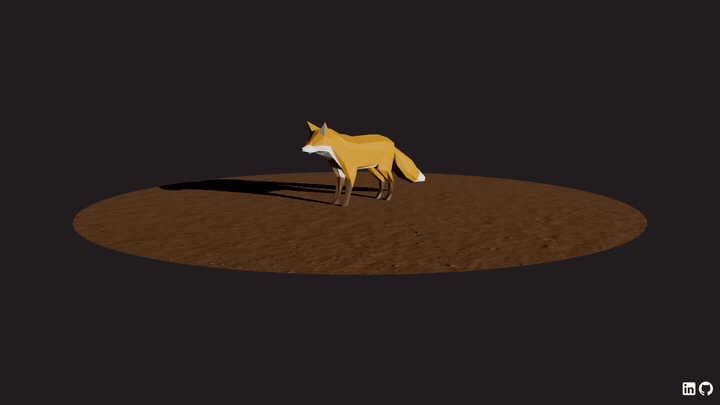

<h1 align="center">🦊 Animated Model — Structured Three.js</h1>

<p align="center">An animated glTF Fox with switchable idle / walk / run clips, built on a clean, class-based Three.js architecture designed to scale beyond a single script file.</p>

<p align="center">
  <a href="https://threejs-model-animation-eacuna.netlify.app/"></a>
</p>

<p align="center">
  
</p>

<p align="center">
  
  
  
  
  
</p>

## About

This one is as much about **code architecture** as it is about the 3D. Instead of one big script, the project is organized into a reusable `Experience` structure:

```
src/Experience/
├── Experience.js      # singleton entry point wiring everything together
├── Camera.js · Renderer.js
├── Utils/             # Sizes, Time, Resources (async loading), EventEmitter, Debug
└── World/             # Fox, Floor, Environment, World
```

- 🦊 Animated glTF Fox driven by Three.js `AnimationMixer`, with blended clip switching
- 🧱 Modular, event-driven architecture (custom `EventEmitter`, `Time`, `Sizes`)
- 📦 Centralized async resource loading
- 🎛️ A wrapped debug GUI you can toggle on

## Tech

Three.js · `AnimationMixer` · glTF + Draco loaders · custom class-based architecture · lil-gui · Vite

## Run locally

```bash
npm install   # first time only
npm run dev   # local server at localhost:8080
npm run build # production build in dist/
```

> **Note:** model files under `static/models/` aren't committed (only a `.gitkeep`) — add the Fox glTF (or your own) before running.

---

<p align="center"><i>Part of my Three.js journey · <a href="https://estebanacuna.dev">estebanacuna.dev</a></i></p>
